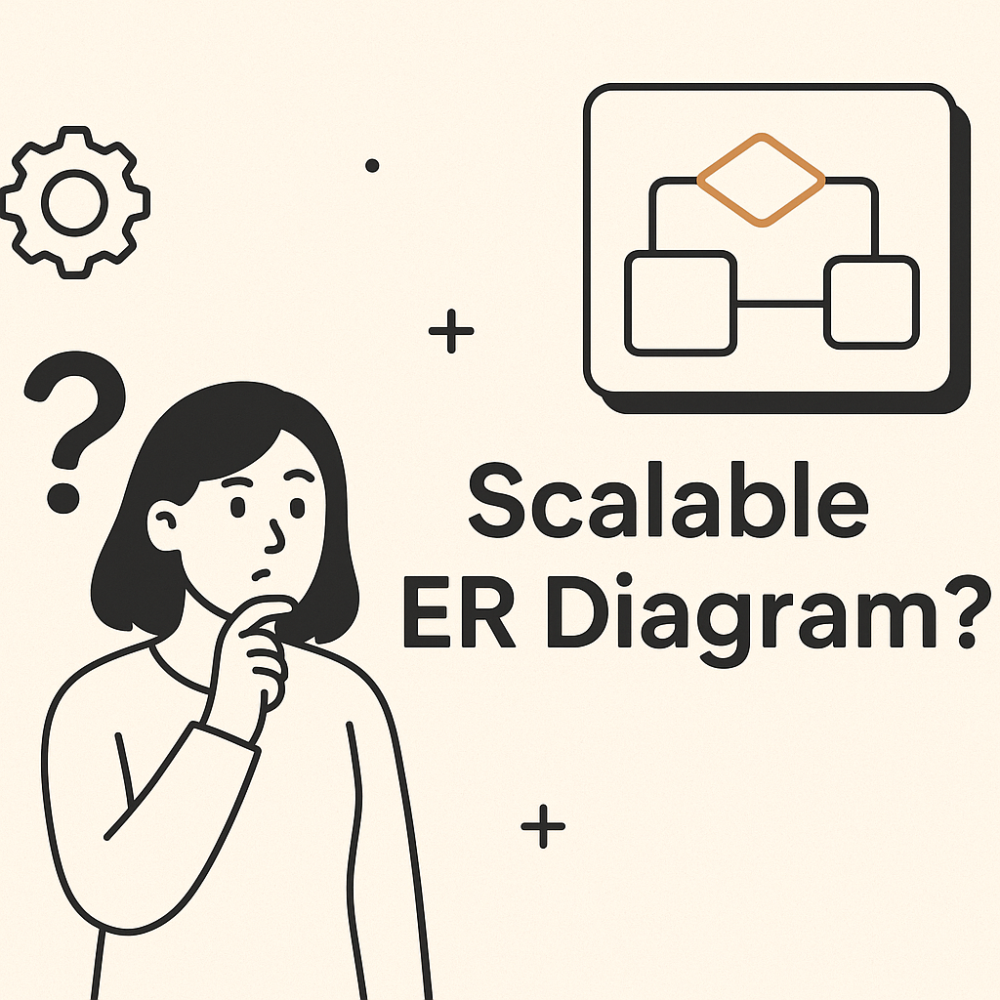

## Awalnya Semua Terlihat Sederhana... Sampai Client Minta Tambahan 😅

Waktu pertama kali bikin ERD, saya pikir: "Ah, gampang. Tinggal bikin tabel, kasih relasi, selesai."  
Tapi ternyata... dua bulan kemudian client minta fitur baru, dan struktur database saya langsung berantakan.

Dari situ saya belajar: **ERD yang baik itu harus siap berkembang sejak awal**.  
Dan berikut 3 tips yang selalu saya pegang dari pengalaman proyek nyata.

---

## 1. Mulai dari Use Case, Bukan dari Tabel 📋

Banyak orang langsung buka draw.io atau dbdiagram.io buat bikin tabel.  
Padahal, sebelum itu, kita harus paham:

- Siapa yang akan pakai sistem?
- Data apa yang akan mereka masukkan?
- Bagaimana alur data berpindah?

💡 *Contoh:* Di proyek *plantation monitoring*, saya mulai dari alur kerja lapangan → baru terjemahkan jadi tabel `users`, `plantations`, `reports`, dll.

📌 **Kesalahan umum:** Mulai dari tabel user & produk, padahal alurnya belum jelas → ujungnya banyak tabel yang nggak kepakai.

---

## 2. Gunakan Normalisasi Secukupnya ⚖️

Normalisasi itu penting biar data nggak redundan.  
Tapi, **terlalu normalisasi** bisa bikin query jadi ribet & lambat.

- Normalisasi → Untuk data yang sering di-*update*.
- Denormalisasi → Untuk data yang jarang berubah tapi sering di-*query*.

💡 *Contoh:* Di sistem e-commerce, data harga produk jarang berubah → bisa disimpan langsung di tabel `products` daripada dipisah ke tabel lain.

📌 **Tips pribadi:** Saya biasanya berhenti di **3rd Normal Form (3NF)** kecuali ada kebutuhan khusus.

---

## 3. Rencanakan untuk Skalabilitas Sejak Awal 🚀

ERD yang skalabel harus mempertimbangkan:
- **Primary key & indexing** → Pastikan query tetap cepat meski data jutaan.
- **Foreign key** → Jaga integritas data.
- **Relasi Many-to-Many** → Selalu gunakan tabel pivot (junction table).
- **Soft delete** → Gunakan `deleted_at` untuk menghindari kehilangan data permanen.

💡 *Contoh:* Di sistem inventory, saya selalu bikin tabel `transactions` terpisah dari `stock` untuk memudahkan histori & audit.

---

## Intinya

ERD yang baik itu:
1. Dibuat berdasarkan use case.
2. Normalisasi secukupnya.
3. Dirancang untuk tumbuh.

Dari pengalaman, desain ERD yang skalabel bikin kita hemat waktu saat proyek berkembang.  
Karena sekali database kamu kacau, perbaikannya bisa makan waktu berhari-hari bahkan berminggu-minggu. 😉

Kalau kamu punya tips lain soal desain ERD, tulis di komentar. Siapa tahu bisa jadi pelajaran berharga buat yang lain.
