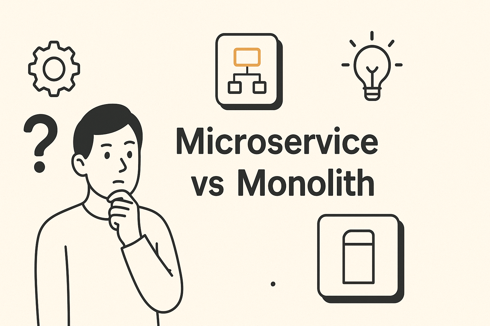

## “Skalanya Kecil, Kok Sudah Microservices?” 🤔

Saya pernah ketemu tim yang baru punya 3 fitur, tapi arsitekturnya sudah *microservices* penuh dengan 8 service, 8 repo, 8 pipeline.  
Hasilnya? Progress lambat, debugging susah, *ops* kebakaran tiap minggu.  

Dari situ saya belajar: **arsitektur itu bukan soal gengsi, tapi soal konteks.**  
Yuk, kita bedah secara praktis **Monolith vs Microservices** — tanpa mitos.

---

## Apa Itu Monolith & Microservices (Versi Santai)

- **Monolith**: Semua fitur backend berada dalam satu aplikasi yang utuh. Satu repo, satu deploy, satu sumber kebenaran.
- **Microservices**: Aplikasi dipecah menjadi layanan-layanan kecil yang independen (auth, order, payment, dsb.), berkomunikasi via API/queue.

> **Intinya:** Monolith = sederhana & cepat gerak. Microservices = modular & fleksibel di skala besar.

---

## Kapan Pilih **Monolith**? ✅

Cocok jika kamu:
- **Masih validasi produk (MVP)** → kebutuhan sering berubah.
- **Tim kecil (≤ 8 orang)** → fokus ke kecepatan fitur, bukan orkestrasi.
- **Budget terbatas** → satu pipeline CI/CD, satu environment.
- **Domain belum stabil** → schema database & boundary masih geser-geser.
- **Butuh kecepatan iterasi** → *hotfix* dan refactor lebih mudah.

**Kelebihan Monolith:**
- Debugging gampang (satu proses, *single source of truth*).
- Transaksi database lintas fitur mudah (satu DB).
- Biaya operasional rendah (infra, observability, dev tooling).

**Risiko Monolith:**
- Bisa jadi *big ball of mud* kalau disiplin modularitas lemah.
- Skala tim besar butuh *code ownership* yang jelas.

---

## Kapan Pilih **Microservices**? ✅

Masuk akal jika kamu:
- **Skala besar** (traffic tinggi, domain kompleks).
- **Kebutuhan *independent scaling*** → misal modul “search” butuh 10x resource dibanding modul lain.
- **Tim besar & spesialis** → banyak squad dengan *release cadence* berbeda.
- **Batas domain jelas** (DDD) → *bounded context* terdefinisi rapi.
- **Toleransi ops** (SRE/DevOps kuat) → siap monitoring, tracing, *chaos* kecil-kecilan.

**Kelebihan Microservices:**
- Otonomi tim & *deployment* independen.
- *Fault isolation* lebih baik (satu service down ≠ semuanya down).
- Teknologi heterogen per service (pilih tool terbaik per masalah).

**Biaya Tersembunyi:**
- Observability: tracing, metrics, log (Grafana, Prometheus, OpenTelemetry).
- Reliabilitas: circuit breaker, retry, backoff, *idempotency*.
- Data: *eventual consistency*, *saga pattern*, *outbox*.
- Orkestrasi: service discovery, *config*, secret, gateway, *zero-trust*.

---

## Tabel Perbandingan Singkat

| Aspek | Monolith | Microservices |
|---|---|---|
| Kecepatan MVP | ⭐⭐⭐⭐ | ⭐⭐ |
| Kompleksitas Operasional | ⭐ | ⭐⭐⭐⭐ |
| Skala Tim | Kecil–Sedang | Sedang–Besar |
| Biaya Awal | Rendah | Tinggi |
| Skalabilitas Selective | Terbatas | Kuat |
| Debugging | Mudah | Sulit (butuh tracing) |
| Transaksi Lintas Modul | Mudah (satu DB) | Kompleks (saga/outbox) |

---

## Anti-Pattern yang Sering Terjadi 😵‍💫

1. **“Distributed Monolith”**  
   Semua service saling bergantung rapat, versi harus dirilis bersamaan → ribet tanpa manfaat microservices.

2. **“Premature Decomposition”**  
   Domain belum jelas, tapi sudah dipecah jadi banyak service → *churn* tinggi & *ops* berat.

3. **“One DB to Rule Them All”**  
   Microservices tapi satu database besar bareng-bareng → coupling data, *blast radius* luas.

---

## Strategi Aman: **Monolith Dulu, Pisah Bertahap** 🪜

1. **Start as Modulated Monolith**  
   - Pisahkan *module* (auth, billing, catalog) di layer aplikasi.  
   - Terapkan *clean architecture* & *bounded context* di dalam monolith.

2. **Identifikasi Hotspot**  
   - Pantau modul paling sibuk (CPU, latency, error rate).  
   - Mulai *extract* modul tersebut jadi service terpisah.

3. **Contract-First**  
   - Rancang *API contract* (OpenAPI/Protobuf).  
   - Pastikan *idempotency*, *backward compatibility*.

4. **Data & Event**  
   - Terapkan pola **Outbox** untuk *event-driven*.  
   - Gunakan **saga** untuk transaksi lintas service.

5. **Perimeter Keamanan**  
   - API Gateway, *zero-trust networking*, mTLS/JWT antar service.

---

## Checklist Keputusan (5 Pertanyaan Cepat)

- Apakah **produk masih berubah cepat**? → **Monolith.**  
- Apakah **tim kecil** dan **deadline mepet**? → **Monolith.**  
- Apakah ada **bottleneck modul spesifik** yang butuh *independent scaling*? → Pertimbangkan **microservice untuk modul itu saja**.  
- Apakah kamu **punya tim SRE/DevOps** & observability matang? → **Microservices mungkin layak.**  
- Apakah **boundary domain sudah jelas**? → **Microservices** lebih aman.

---

## Rekomendasi Praktis (Tooling Singkat)

- **Monolith**: Laravel/Node/Go dengan *modular packages*, satu repo + GitHub Actions.  
- **Microservices**: gRPC/REST + OpenAPI, Kafka/RabbitMQ (event), Kubernetes, OpenTelemetry, konsul/service mesh, *feature flag*.

---

## Intinya

- **Monolith** unggul untuk **kecepatan & kesederhanaan**.  
- **Microservices** unggul untuk **skala besar & otonomi tim**, tapi **mahal secara operasional**.  
- Strategi paling aman: **mulai monolith yang terstruktur**, lalu **ekstrak service** saat *pain* dan *data* benar-benar membutuhkannya.

Kalau kamu sedang bingung memilih, ceritakan konteks tim & produkmu — saya bisa bantu bikin **rencana arsitektur & jalur migrasi** yang realistis. 😉