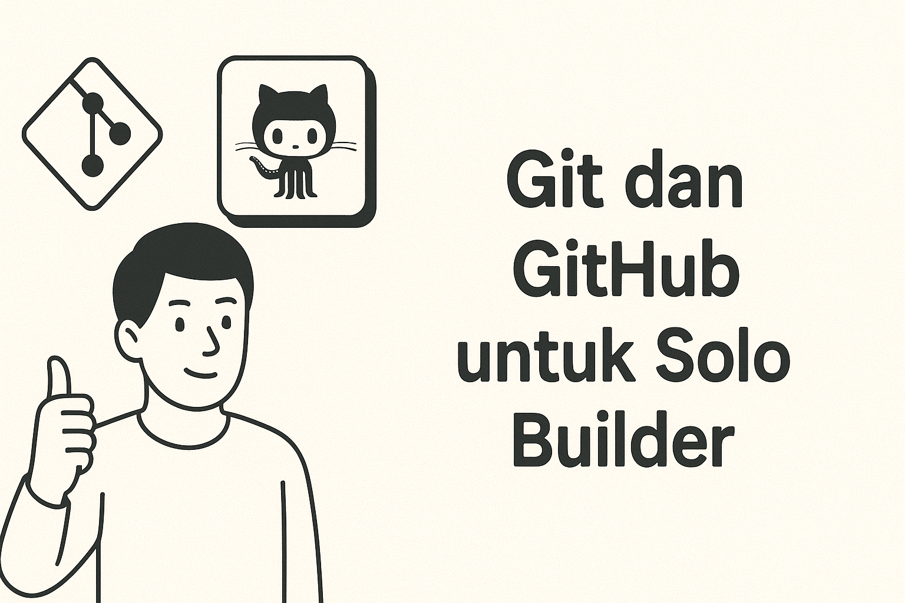

## Solo Builder = Satu Orang, Banyak Peran 👨‍💻

Bayangkan mengelola sebuah proyek sendirian. Kamu adalah codernya, project managernya, testernya, bahkan devopsnya. Seperti seorang _one-man band_ yang memainkan semua instrumen sekaligus.

Saya masih ingat jelas saat pertama kali mengelola repo sendirian. Rasanya seperti kamar anak remaja - berantakan! 😅

Contoh kekacauan yang sering terjadi:
```bash
# Commit messages yang membingungkan
git commit -m "fix lagi"
git commit -m "benerin dikit"
git commit -m "coba deh"
```

Setelah beberapa kali project hancur karena manajemen Git yang buruk, akhirnya saya menemukan formula yang tepat untuk solo developer.

## 1. Branching Strategy ala Microservice 🌿

Lupakan branching strategy kompleks ala enterprise. Sebagai solo developer, kita butuh sesuatu yang simpel tapi powerful:

```bash
main    → Kode production yang sudah stabil
dev     → Tempat experimen fitur baru
feature/* → Pengembangan fitur spesifik
hotfix/* → Perbaikan bug urgent di production
```

> 💡 **Pro tip:** Treat `main` branch seperti harta karun - jangan sembarangan push!

## 2. Commit Message yang "Berbicara" ✍️

Bayangkan commit message sebagai "diary" projectmu. Buatlah formatnya konsisten:

```bash
feat: implement JWT authentication
fix: resolve email validation edge cases
chore: upgrade dependencies to latest version
docs: add API documentation for new endpoints
```

## 3. Self Code Review dengan Pull Request 🔄

"Tapi kan aku kerja sendiri, ngapain bikin PR?"

Justru karena sendiri, kita butuh sistem untuk:
- Mendokumentasikan perubahan
- Memaksa diri review kode sebelum merge
- Membuat history perubahan yang trackable

---

## 4. Gunakan Release & Tagging 🏷️

Jangan biarkan semua versi campur aduk.  
Gunakan **tag versi** setiap kali rilis stabil:
v1.0.0 → MVP pertama
v1.1.0 → fitur baru ditambah
v1.1.1 → bugfix kecil
📌 Ini bikin rollback gampang kalau ada error setelah deploy.

---

## 5. Otomatisasi dengan GitHub Actions ⚡

Biar nggak repot deploy manual:
- Setup CI/CD dengan GitHub Actions.  
- Tes otomatis jalan tiap push.  
- Deploy ke server/cloud dengan sekali klik.  

📌 *Contoh use case:* setiap push ke `main` → otomatis deploy ke server.

---

## 6. Jaga Dokumentasi Repo 📚

Repo rapi itu bukan cuma soal kode:
- **README.md** → jelaskan setup project & cara jalanin.  
- **.gitignore** → hindari file sampah ikut commit.  
- **LICENSE** → tentukan lisensi project (MIT, Apache, dsb.).  

💡 *Pro tip:* Tambahkan `CONTRIBUTING.md` walau masih solo — ini investasi kalau nanti ada kolaborator.

---

## Kesimpulan

Git workflow yang rapi bukan cuma untuk tim besar. Sebagai solo developer, ini adalah investasi untuk:
- Mental health kamu (tidak stress waktu debugging)
- Skalabilitas project ke depan
- Kesiapan kolaborasi di masa depan

Remember: "Code like you'll maintain it forever, document like you'll leave tomorrow." 🚀

---

> 🎯 **Action Points:**
> 1. Audit Git workflow kamu sekarang
> 2. Implement minimal satu best practice minggu ini
> 3. Share pengalaman kamu di comments!