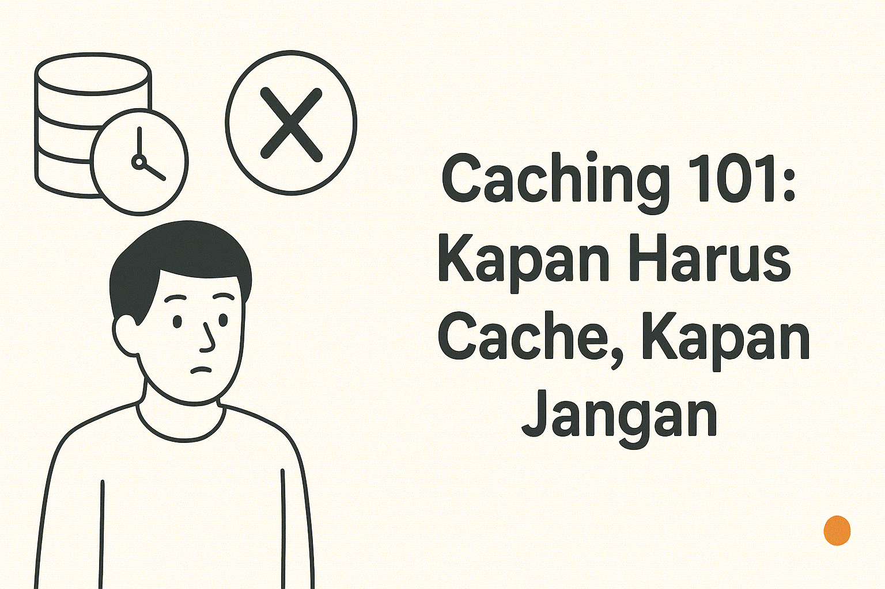

## Cache Itu Kayak Shortcuts 🏎️

Pernah nggak, kamu buka aplikasi, terus loading terasa lambat?  
Biasanya solusinya: **cache**.  
Cache itu kayak bikin “jalan pintas” → data disimpan sementara biar nggak perlu dihitung ulang.  

Tapi hati-hati, cache bukan selalu jawaban.  
Salah pakai cache bisa bikin data basi, bug misterius, bahkan bikin performa makin kacau.  

---

## Apa Itu Caching?

Secara simpel: **caching adalah teknik menyimpan data sementara di tempat yang lebih cepat diakses**.  
Contoh:
- **Browser cache** → simpan gambar/logo supaya nggak download ulang.  
- **API cache** → simpan hasil query DB supaya respon lebih cepat.  
- **In-memory cache** (Redis/Memcached) → simpan data sering dipakai langsung di RAM.  

---

## Kapan Harus Cache ✅

### 1. Data Jarang Berubah
Contoh: daftar provinsi/kota, daftar kategori produk.  
💡 Cache bikin respon cepat tanpa sering query DB.

---

### 2. Query Berat atau Mahal
Contoh: report penjualan tahunan dengan ribuan transaksi.  
💡 Simpan hasil query → user lain tinggal ambil dari cache.

---

### 3. High Traffic dengan Pola Akses Sama
Contoh: halaman landing page atau artikel populer.  
💡 Cache di level CDN (Cloudflare, Varnish) bisa hemat bandwidth & server load.

---

### 4. API Pihak Ketiga
Kalau sering call API eksternal yang lambat atau ada limit request.  
💡 Cache hasil respons supaya nggak selalu hit API.  

---

## Kapan Jangan Cache ❌

### 1. Data Selalu Berubah Real-Time
Contoh: saldo rekening, jumlah stok barang.  
🚫 Cache bisa bikin user lihat data basi → bahaya di transaksi.

---

### 2. Data Sangat Kecil & Murah
Contoh: query `SELECT * FROM users WHERE id = ?`.  
🚫 Overkill kalau di-cache, karena query ini super ringan.

---

### 3. Data Sensitif
Contoh: informasi pribadi, token, atau password hash.  
🚫 Jangan cache sembarangan → bisa bocor keamanan.

---

### 4. Sistem Belum Punya Monitoring
Kalau nggak ada observability, cache bisa jadi bom waktu.  
Data bisa kedaluwarsa tanpa ketahuan.  

---

## Best Practice Caching 🔑

- Tentukan **TTL (time to live)** → biar data nggak basi.  
- Gunakan **cache invalidation** → hapus cache kalau data berubah.  
- Simpan cache di tempat aman (Redis, Memcached), bukan file random.  
- Monitor **hit ratio** → pastikan cache benar-benar berguna.  

---

## Intinya

Cache itu powerful, tapi bukan obat segala masalah.  
- **Harus cache**: data jarang berubah, query berat, traffic tinggi.  
- **Jangan cache**: data real-time, kecil, sensitif, atau tanpa monitoring.  

Ingat pepatah lama developer:  
**“There are only two hard things in Computer Science: cache invalidation and naming things.”** 😅  

Kalau kamu paham kapan harus cache & kapan jangan, performa aplikasi bisa naik drastis tanpa bikin bug misterius. 😉