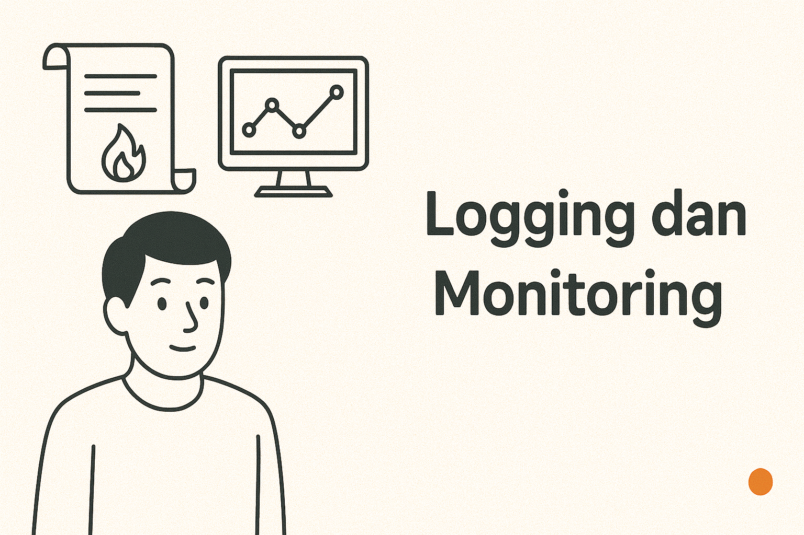

## Error Pertama di Production 😅

Saya masih ingat momen waktu pertama kali deploy aplikasi ke production.  
Semua terasa mulus... sampai user bilang: **“kok tombol checkout nggak bisa ya?”**  

Masalahnya, saya **nggak pasang logging & monitoring** dari awal.  
Akhirnya debugging buta:  
- Cek kode berulang kali,  
- Tanyain user langkah demi langkah,  
- Deploy ulang berkali-kali.  

Butuh 2 hari hanya untuk nemuin bug sederhana.  
Sejak itu saya sadar: **logging & monitoring wajib sejak hari pertama.**

## Kenapa Logging Itu Penting? 📜

Logging = catatan jejak aplikasi.  
Tanpa log, kita kayak nyari jarum di tumpukan jerami.

### Manfaat Logging:
- Lihat error detail (stack trace, request, respon).  
- Rekam event penting (login, transaksi, API call).  
- Audit trail untuk keamanan.  

📌 *Best practice:* Gunakan **structured logging** (JSON format) biar gampang di-parse ke tool analitik.

---

## Kenapa Monitoring Itu Penting? 👀

Monitoring = radar kesehatan aplikasi.  
Bukan cuma soal “up atau down”, tapi juga kondisi performa.

### Manfaat Monitoring:
- Pantau CPU, memory, response time.  
- Deteksi dini sebelum sistem crash.  
- Notifikasi real-time kalau ada error atau anomali.  

📌 *Tool populer:* Grafana, Prometheus, New Relic, Datadog.

---

## Wajib dari Hari Pertama, Bukan Nanti 🚨

Banyak dev mikir: “Logging & monitoring nanti aja kalau user sudah banyak.”  
Padahal, justru:
- Hari pertama = momen paling rawan error.  
- Tanpa log/monitor, error kecil bisa bikin user kabur.  
- Pasang dari awal lebih mudah dibanding pasang belakangan.  

---

## Checklist Logging & Monitoring 🔑

- [ ] Setup logger (Winston, Monolog, Zap).  
- [ ] Simpan log di tempat terpusat (ELK stack, Loki).  
- [ ] Pasang monitoring server (Prometheus + Grafana).  
- [ ] Tambahkan alert (Slack, Discord, email).  
- [ ] Logging sensitif → filter/anonimkan data pribadi.  

---

## Intinya

Logging & monitoring bukan fitur tambahan, tapi **fondasi aplikasi yang sehat**.  
- Logging = catatan detail error & event.  
- Monitoring = deteksi kesehatan & performa sistem.  

Kalau dua hal ini dipasang sejak hari pertama deploy, kamu bisa tidur lebih nyenyak.  
Kalau tidak? Bersiaplah begadang debugging di production. 😉