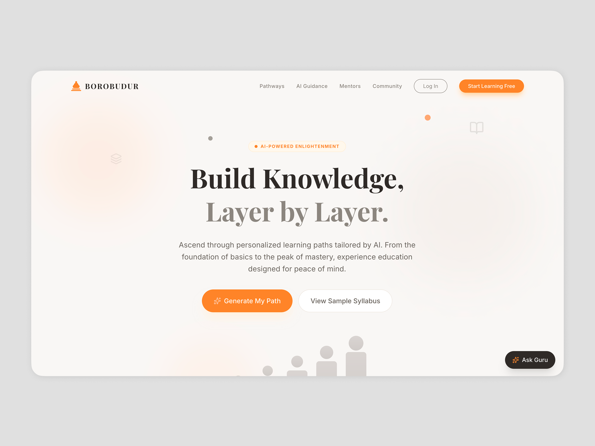
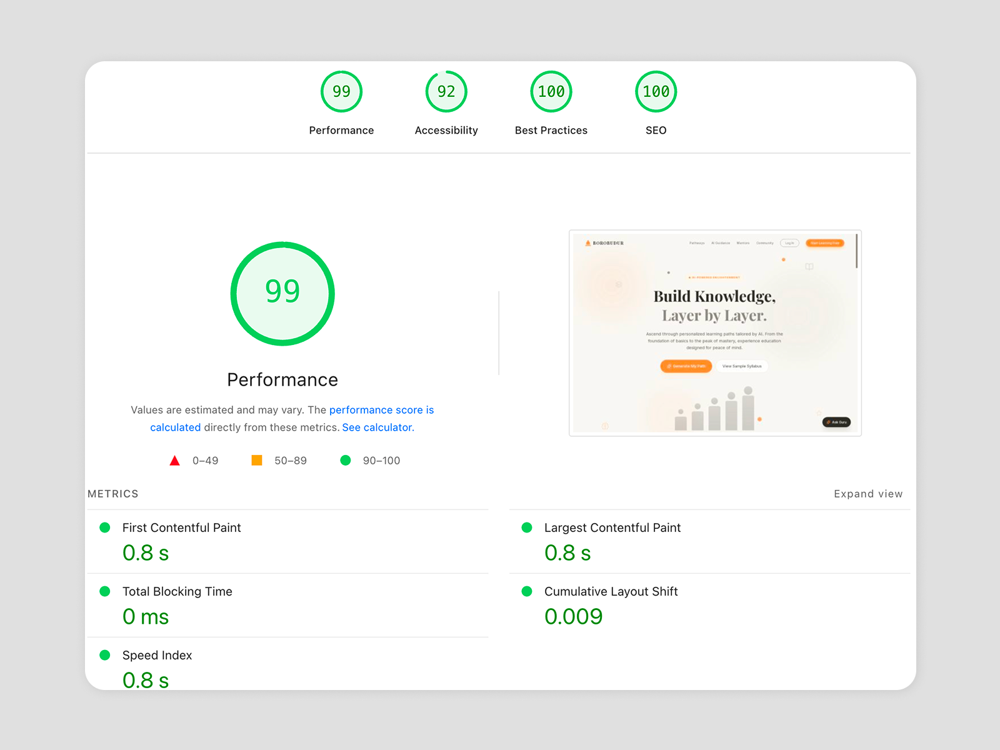

🟢 **Status:** Live  
🗼 **Lighthouse Score:** [Full Report](https://pagespeed.web.dev/analysis/https-borobudur-learning-vercel-app/vjh6c18i9h?form_factor=desktop&category=performance&category=accessibility&category=best-practices&category=seo&hl=en-US&utm_source=lh-chrome-ext)  
🌐 **Live Demo:** [Borobudur Learning](https://borobudur-learning.vercel.app)  
🛒 **Get Template:** [Available on Gumroad](https://studiokoma.gumroad.com/l/borobudur-learning)

**Role:** AI Product Engineer  
**Tech Stack:** Astro 5, React 19, TypeScript, Tailwind CSS 4, Google Gemini AI, GSAP

### 🚀 Executive Summary
Designed and engineered Borobudur Learning, a high-performance educational platform that bridges the gap between static content and interactive AI-driven learning. By leveraging a hybrid architecture (Astro + React), the platform achieves near-instant load times (Lighthouse 95+ scores) while delivering complex, client-side interactive features like an AI Socratic Tutor and dynamic Syllabus Generator.

### 💡 The Challenge
Traditional Learning Management Systems (LMS) often suffer from two extremes: they are either sluggish, heavy Single Page Applications (SPAs) or static sites with limited interactivity. The goal was to build a solution that offered:
1. SEO-dominance and rapid FCP (First Contentful Paint) for marketing pages.
2. Rich interactivity for learning tools.
3. Modern aesthetic that differentiates from corporate, bootstrap-style competitors.

### 🛠️ The Solution: "Island Architecture"
I utilized Astro's Island Architecture to hydrate only the necessary interactive components, keeping the main thread free for critical rendering.

1. Hybrid Rendering Engine
   - Static Core: The landing layout, marketing copy, and structural elements are statically generated (SSG) for zero-JavaScript overhead.
   - Interactive Islands: React 19 components (SyllabusModal, GuruChat) are lazily loaded only when users interact with specific triggers, reducing initial bundle size by ~60% compared to a traditional SPA.

2. Intelligent Content Generation (GenAI)  
Integrated Google Gemini API to create a "Socratic" learning experience.
   - Dynamic Syllabus Generaton: Engineered a prompt chain that accepts a simple topic (e.g., "Quantum Physics") and returns a structured, hierarchical 5-level learning path in JSON format, parsed and rendered instantly.
   - Streaming Responses: Implemented real-time response streaming for the AI chatbot to minimize perceived latency, providing an immediate "human-like" conversational feel.

3. Motion Engineering & UX  
To create a premium "app-like" feel on the web:
   - Smooth Scrolling: Implemented Lenis for momentum-based scrolling, normalizing friction across different browsers and input devices.
   - Performance-First Animations: Used GSAP ScrollTrigger for scroll-linked animations. Crucially, animations are optimized to animate transform and opacity properties only, avoiding costly layout thrashing.
   - Staggered Reveals: Custom hooks manage staggered entry animations for list items, guiding user attention naturally down the page.

### 💻 Tech Stack & Tooling
| Domain | Technology | Why it was chosen |
| :--- | :--- | :--- |
| **Core Framework** | Astro 5 | Best-in-class performance, framework-agnostic islands. |
| **UI Library** | React 19 | Robust ecosystem for complex state management (AI chat, Modals). |
| **Language** | TypeScript | Enforced strict type safety for API responses and component props. |
| **Styling** | Tailwind CSS 4 | Rapid UI development with low-level utility control. |
| **Motion** | GSAP + Lenis | Industry standard for complex, timeline-based sequencing. |
| **AI** | Google Gemini | High token limit and fast inference for educational context. |

### 🌟 Key Features Implemented
#### 🧠 AI Syllabus Architect
Users enter a topic, and the system "architects" a curriculum.
- Technical Detail: Custom prompt engineering ensures the JSON output adheres to a strict schema, handled gracefully by Zod validation schemas on the frontend to prevent runtime errors.

#### 💬 Socratic Chatbot
A tutor that asks questions back.
- Technical Detail: Maintained conversation context in a lightweight React state, sending sliding window history to the API to preserve "memory" without exceeding context windows.

#### ⚡ Performance Optimization
- Image Optimization: Automatic format conversion (WebP/AVIF) and layout shift protection.
- Code Splitting: Automatic chunking of React components.
- Perfect Lighthouse Scores: Consistently hitting 99-100 in Performance, Accessibility, and Best Practices.

### 📂 Code Quality & Standards
- Strict TypeScript: No any types. All props and API responses are strictly typed.
- Modular Design: Components are atomic and reusable (e.g., generic Modal, Button, Card components).
- Configuration-Driven: The entire site text, branding, and navigation are controlled via a single config.ts file, making it easily white-labeled.

### 🏁 Conclusion
Borobudur Learning demonstrates how modern web technologies can transform educational content. It moves beyond simple "text on a screen" to create an immersive, intelligent, and instantaneous learning environment.

> "The intersection of perfect performance and rich interactivity."

---

**Interested in a similar solution for your business?**  
[Let's connect →](mailto:andriancyns@gmail.com)