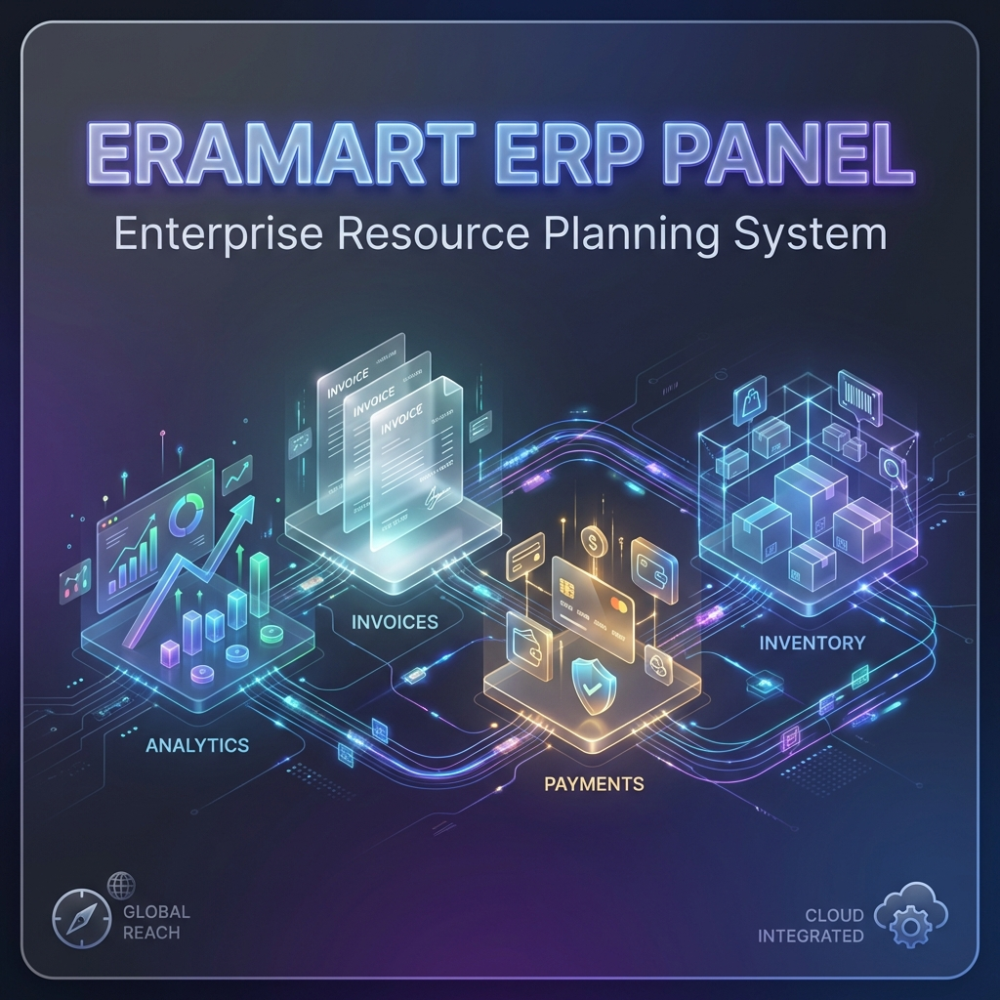

🟢 **Status:** Live — currently in active development <br/>

**Role:** Full-Stack Laravel Developer <br/>
**Contribution:** Top Contributor (899 commits)

### Tech Stack
- **Frontend:** PHP 7.4+, Laravel 8.x
- **Backend:** Blade Templates, jQuery, Bootstrap 4
- **Database:** MySQL
- **Deployment:** DataTables, Select2, SweetAlert2, AutoNumeric, DomPDF, PhpSpreadsheet
- **Version Control:** Git, GitLab

---

## ✨ Key Features Developed

### 1. 📊 Store Reporting System

Developed a comprehensive reporting module with 4 sub-modules for purchasing analytics:

#### Purchase Request Report
- Server-side DataTables with row grouping by supplier
- Summary and detail view modes with expand/collapse functionality
- Multi-format export: **PDF, Excel, RTF (Word)**
- Real-time KPI summary (total items, total value)
- Status tracking integration with Purchase Order

#### Purchase Order Report
- Dynamic filtering by date range, supplier, branch, and status
- DataTables row grouping with subtotals per group
- Status badges for visual order tracking
- Discount and tax breakdown columns
- Grand total calculation with proper currency formatting

#### Purchase Receipt Report
- Summary view for quick overview
- Detailed view with itemized breakdown
- Print-optimized layouts (portrait/landscape)
- Date formatting localization

#### Purchase Invoice Report
- Summary and detail views with toggle
- A4 landscape PDF generation
- Excel export with company logo header
- Proper number formatting (avoiding scientific notation)

**Technical Highlights:**
```php
// Server-side DataTables with complex joins
$query = PurchaseOrder::select([
    DB::raw('GROUP_CONCAT(th_purchase_order.no_po) as rowgroup'),
    'mh_supplier.nm_supplier',
    DB::raw('SUM(total_nilai) as nilai')
])
->leftJoin('mh_supplier', 'th_purchase_order.id_mh_supplier', '=', 'mh_supplier.id_mh_supplier')
->groupBy('th_purchase_order.id_mh_supplier');
```

🎬 **[Video Demo](https://www.loom.com/share/17fde8bc21b14e86bd7b3df5f2d2fca2)**

---

### 2. 💳 List of Payment (LOP) Module

Payment management system for supplier invoices and returns:

- **Parent Supplier Validation** - Hierarchical supplier organization with validation against parent supplier
- **Transaction Types** - Support for both invoice (Faktur) and return (Retur) payments
- **Financial Fields** - Shipping cost (ongkos kirim), stamp duty (materai) integration
- **Audit Trail** - Comprehensive logging for DPP and PPN changes
- **DO Number Reference** - Delivery order tracking in payment context
- **SweetAlert2 Integration** - Modern UX for approve/cancel confirmations

🎬 **[Video Demo](https://www.loom.com/share/8369078287e44a3a84015115d326805f)**

---

### 3. 📄 Invoice Receipt (Tanda Terima Faktur) Module

Invoice receipt management with tax calculation features:

- **PPN Validation** - Warning modal when PPN difference ≥ Rp 500
- **DPP Calculation** - Support for both 11% and 12% rates
- **Manual PPN Flag** - Tracking for manually filled PPN values
- **Materai & Shipping** - Additional cost field integration
- **Print Layout** - Custom page size (4.8in x 5.5in) for receipt printing
- **AJAX Form Handling** - Asynchronous submission with SweetAlert2 feedback

🎬 **[Video Demo](https://www.loom.com/share/c56850615d8047569635c94dd051b2a4)**

---

### 4. 📦 Banded Item (Product Bundling) System

Product bundling/packaging system for composite items:

- **Barcode Scanner Integration** - Real-time barcode scanning with status indicator
- **Stock Validation** - Zero-stock warning with SweetAlert2 notifications
- **Decimal Quantity Support** - Handles KG units with decimal precision
- **AutoNumeric Integration** - Proper number input formatting
- **Production Tracking** - Quantity production with print layout

**Technical Highlights:**
```javascript
// Barcode scanner with status indicator
$('#barcodeInput').on('input', function() {
    const code = $(this).val();
    searchProductByBarcode(code).then(product => {
        if (product.stock <= 0) {
            Swal.fire('Warning', 'Stock habis!', 'warning');
        }
        addToDetailTable(product);
    });
});
```

🎬 **[Video Demo](https://www.loom.com/share/676c24676c4f4b36a34eddc79385d5b7)**

---

### 5. 💰 Cash Expenditure (Bukti Kas Keluar) Module

Cash outflow documentation and approval system:

- **Audit Logging** - Track all changes with user attribution
- **TTHO Link Management** - Invoice receipt linking/unlinking
- **Enhanced Print View** - Company details and formatted layouts
- **Date Filtering** - Quick date filters with DataTables integration

🎬 **[Video Demo](https://www.loom.com/share/f62db5ed07ab418f8887151066c56b38)**

---

### 6. 🔧 Technical Improvements & Infrastructure

#### DataTables Optimization
- Server-side processing for large datasets
- Custom column filtering with search by specific fields
- Row grouping with expandable/collapsible sections

#### Excel Export Enhancement
- Company logo integration in headers
- Auto-column sizing
- Custom row/column dimensions
- Number format preservation (avoiding scientific notation)

#### UX Improvements
- SweetAlert2 migration from native alerts/confirms
- Select2 enhanced dropdowns with AJAX search
- Form validation with specific error messages
- IMask integration for formatted inputs

#### Database Migrations
- Schema updates for new features
- Data migration scripts
- Menu system management

---

## 📈 Achievements & Impact

| Metric | Value |
|--------|-------|
| **Total Commits** | 899 (Top Contributor) |
| **Team Size** | 10+ developers |
| **Contribution Period** | 2024 - Present |
| **Modules Developed** | 6 major modules |
| **Reports Created** | 4 complete report modules |

---

## 🛠️ Skills Demonstrated

### Technical Skills
- **Backend Development** - Laravel MVC architecture, Eloquent ORM, Query Builder
- **Frontend Development** - jQuery, Blade templating, responsive design
- **Database Management** - MySQL, complex queries, migrations
- **API Integration** - RESTful endpoints, AJAX handling
- **Export/Import** - PDF, Excel, RTF generation
- **Version Control** - Git workflow, branch management, merge requests

### Soft Skills
- **Problem Solving** - Debugging complex business logic
- **Code Quality** - Consistent commit messages, clean code practices
- **Collaboration** - Team git workflow with development/main branches
- **Documentation** - Code comments, migration descriptions

---

**Interested in a similar solution for your business?** <br/>
[Let's connect →](mailto:andriancyns@gmail.com)
