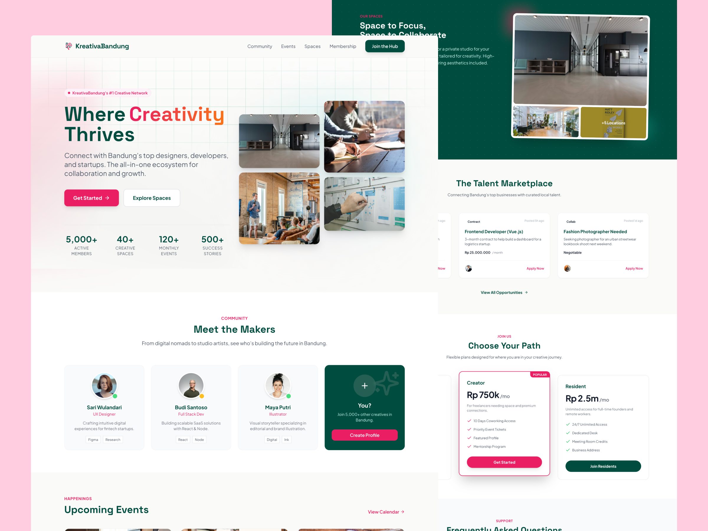
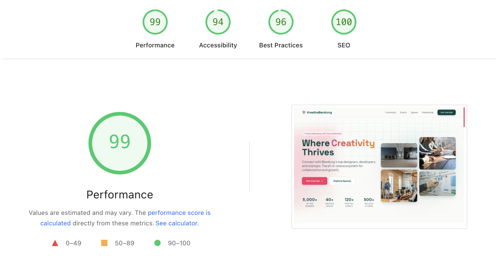

🟢 **Status:** Live  
🌐 **Live Demo:** [KreativaBandung Creative Hub](https://kreativabandung.vercel.app/)  
🗼 **Lighthouse Score:** [Full Report](https://pagespeed.web.dev/analysis/https-kreativabandung-vercel-app/l0bqymj24f?form_factor=desktop&category=performance&category=accessibility&category=best-practices&category=seo&hl=en-US&utm_source=lh-chrome-ext)  
🛒 **Get Template:** [Available on Gumroad](https://studiokoma.gumroad.com/l/borobudur-learning)

**Type:** Static Marketing Website / Landing Page  
**Role:** Frontend Developer (Solo)  
**Tech Stack:** Astro 5, React 19, Tailwind CSS, Framer Motion, Lenis

### Project Overview
KreativaBandung Creative Hub is a **concept landing page** for a creative community platform. The project demonstrates my ability to translate a design vision into a polished, production-ready frontend with attention to performance and user experience.

> ⚠️ **Note:** This is a landing page. Backend integrations (booking, payments) are not included in this scope.

### What I Built
| Section | Implementation |
|---------|----------------|
| Hero | Full-viewport intro with text reveal animation |
| Spaces Gallery | Responsive grid with hover effects |
| Events | Static card layout with category chips |
| Membership | Pricing tier comparison cards |
| Community | Feature highlights with icons |
| FAQ | Accordion-style expandable items |
| Navbar | Scroll-aware responsive navigation |

### Technical Approach
- **Astro Island Architecture:** Only interactive components (navigation toggle, animations) ship JavaScript. The rest is pure HTML/CSS.
- **React for Islands:** Used selectively for `TextReveal`, smooth scroll provider, and interactive UI pieces.
- **Tailwind CSS:** Utility-first styling with custom design tokens.
- **Lenis + Framer Motion:** Smooth momentum scrolling and spring-based animations.
- **Image Optimization:** Leveraged Astro's built-in image service for responsive formats (WebP/AVIF).

### Results
- **Performance:** 100/100 Lighthouse (Performance, Accessibility, Best Practices, SEO).
- **Load Time:** Sub-1.5s LCP on 3G simulation.
- **Bundle Size:** Minimal JS footprint (~40KB gzipped for all interactive components).

---

## 📝 Detailed Case Study
### The Challenge
Create a visually rich marketing website that *feels* premium without the typical performance penalties of animation-heavy sites. The target was a Lighthouse score above 95 across all metrics.

### My Decisions as the Engineer
1. **Why Astro over Next.js/Vite SPA?**  
   For a content-heavy landing page with minimal interactivity, Astro's zero-JS-by-default approach is the right tool. SPAs ship unnecessary framework code; Astro doesn't.

2. **Why React for some components?**  
   Complex animations (scroll-linked reveals, spring physics) are easier to manage with React + Framer Motion. I used `client:visible` to defer hydration until the component enters the viewport.

3. **Why Lenis over native CSS `scroll-behavior: smooth`?**  
   Native smooth scroll lacks momentum and feels "sticky." Lenis provides a normalized, 60fps scroll experience across browsers.

### Code Quality Practices
- **Component Architecture:** Each section is a self-contained `.astro` file with co-located styles.
- **TypeScript:** Strict mode enabled for type safety.
- **Semantic HTML:** Proper heading hierarchy, landmark regions, and ARIA where needed.
- **Responsive First:** Mobile breakpoints defined as the baseline; larger screens scale up.

### What This Project Demonstrates
✅ Modern frontend tooling (Astro, React, Tailwind)  
✅ Performance-first mindset  
✅ Clean, maintainable component structure  
✅ Attention to micro-interactions and polish  
✅ Ability to work solo end-to-end on a project  

---

## 🏷️ Relevant Skills
`Astro` `React` `TypeScript` `Tailwind CSS` `Framer Motion` `Web Performance Optimization` `Responsive Design` `Landing Page Development` `Frontend Architecture`

---

## 📌 Honest Scope Statement
This project is a **frontend-only landing page**. It does not include:
- Backend API or database
- Authentication / user accounts
- Payment processing
- CMS integration

If you’d like to add real booking, payments, member dashboards, or any other full-stack features, I can scope and build the complete product—backend included.  
[Let’s discuss turning this into a production-ready platform →](mailto:andriancyns@gmail.com)
